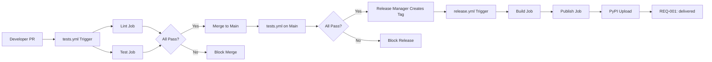

# ADR-002: CI/CD Deployment Strategy for CLI Password Generator

## Context and Problem Statement

REQ-001 is currently at `status: implemented` with all six acceptance criteria tested and passing. ADR-001 is at `status: accepted`. Per MADR-001, the transition from `implemented` to `delivered` requires operational deployment to a production environment where end-users can access the feature.

**Current State Analysis:**

- REQ-001 status: `implemented`
- ADR-001 status: `accepted`
- All ACs (AC-001 through AC-006) have test coverage
- Code merged into main branch
- No CI/CD pipeline established
- No deployment automation to package registries or production

**Problem:** The CLI Password Generator requires a CI/CD pipeline to automate testing, validation, and deployment to enable the status transition from `implemented` to `delivered` per the SDD lifecycle.

**Goal:** Establish a CI/CD pipeline that provides automated testing, quality gates, and deployment automation to package registries (PyPI) for user distribution.

**Enablers:**
- Release to end-users via PyPI package distribution
- Transition REQ-001 to `delivered` status
- Milestone v1.0 closure

## Considered Options

### Option A: GitHub Actions GitHub-owned runner + PyPI

Use GitHub Actions on GitHub-owned runners for CI/CD, with automated PyPI upload via `twine` and GHA secrets for credentials. Include both testing workflow (`tests.yml`) and release workflow (`release.yml`).

**Characteristics:**
- Fully automated testing on every PR and push to main
- Automated PyPI publication on tagged releases
- GitHub Secrets for credential management
- GitHub Releases integration for versioned artifacts

### Option B: GitHub-owned actions only, manual PyPI upload

Use GitHub Actions on GitHub-owned runners for CI testing only. Manual PyPI upload via local `twine` command by maintainer after release tag creation.

**Characteristics:**
- Automated testing on every PR and push to main
- Manual deployment gate with maintainer review
- Maintainer holds PyPI credentials locally
- Reduces automation surface for publication

### Option C: Manual deployment only (no CI/CD)

No CI/CD pipeline. All testing, validation, and deployment performed manually by maintainer on local machine.

**Characteristics:**
- No automated testing infrastructure
- Manual test execution via `pytest`
- Manual PyPI upload via `twine`
- Maximum manual control, minimum automation

## Decision Outcome

Chosen option: **"Option A: GitHub Actions GitHub-owned runner + PyPI"**, because it provides full automation from testing to deployment while maintaining security boundaries through GHA secrets.

### Rationale

This option aligns with the SDD methodology's emphasis on operational automation and audit trail preservation. The CI/CD pipeline serves as evidence for the `delivered` status transition by providing:

1. Automated testing evidence on every change
2. Consistent deployment process with audit trail in GitHub Actions run history
3. Secure credential management via GHA secrets without exposing credentials

Option B introduces manual intervention which creates friction in the release process and potential for human error. Option C provides no automation, which defeats the purpose of establishing CI/CD for production readiness.

### Consequences

Good, because: Full automation reduces manual error surface and ensures consistent testing/deployment

Good, because: Every PR triggers automated tests, providing immediate feedback to contributors

Good, because: Tagged releases automatically publish to PyPI, enabling user access and milestone closure

Good, because: GitHub Actions run history provides audit trail for compliance and debugging

Good, because: GHA secrets isolate PyPI credentials without exposing them in code or logs

Bad, because: External dependency on GitHub Actions service availability — *mitigated/acceptable: Industry-standard platform with 99.9%+ SLA; failure modes acceptable for v1.0 CLI tool*

Bad, because: PyPI credentials must be configured in repository secrets — *mitigated/acceptable: Standard practice; credentials remain isolated to repository maintainers*

Neutral, because: Initial setup cost for workflow configuration — *one-time investment with long-term operational value*

## Implementation Notes

### GitHub Actions Workflow Architecture

Two distinct workflows shall be established:

**tests.yml (CI Testing Pipeline):**
- Triggers: `pull_request` (all branches), `push` to `main`
- Jobs:
  - `lint`: Code style and static analysis
  - `test`: Unit and integration test execution with coverage reporting
- Quality Gates:
  - All tests must pass
  - PR cannot merge without green CI

**release.yml (CD Deployment Pipeline):**
- Triggers: `release` (published GitHub release)
- Jobs:
  - `build`: Package build and validation
  - `publish`: PyPI upload via `twine`
- Authentication:
  - PyPI API token via GHA secret `PYPI_API_TOKEN`
  - GitHub token for release assets

### Workflow Integration Points

### Credential Management Pattern

PyPI credentials shall be configured as repository secrets in GitHub:

- Secret name: `PYPI_API_TOKEN`
- Secret type: PyPI API token (not username/password)
- Scope: Repository-level, accessible only to maintainers
- Rotation: Rotate per security policy or credential compromise

GitHub Actions workflow access to secrets is automatic when referenced via `${{ secrets.PYPI_API_TOKEN }}` in workflow files.

### Release Versioning Pattern

Releases shall follow semantic versioning (SemVer):

- Initial release: `v1.0.0` for milestone v1.0
- Minor changes: `v1.N.0` for backward-compatible features
- Patch changes: `v1.0.N` for bug fixes
- Major changes: `vN.0.0` for breaking changes

GitHub Release tags shall match PyPI package version for traceability.

### Evidence for `delivered` Status Transition

Upon successful pipeline execution, the following evidence artifacts accumulate:

1. GitHub Actions test run history (CI evidence)
2. GitHub Release tag and artifacts (deployment evidence)
3. PyPI package publication record (distribution evidence)
4. User installation capability (access evidence)

These artifacts collectively satisfy MADR-001's `delivered` status criteria:

- Operational deployment to package registry (PyPI)
- End-user access capability (pip install)
- v1.0 milestone release artifacts

## Sources

- REQ-001: CLI Basic Password Generation (status: implemented)
- ADR-001: Python standard library cryptographic decision (status: accepted)
- MADR-001: Distinguishing Implemented from Delivered Status for REQ-001
- AGENTS.md: SDD methodology and status lifecycle rules

---

## Related Artifacts

- REQ-001: CLI Basic Password Generation
- ADR-001: Python standard library for cryptographic password generation
- MADR-001: Status distinction methodology
- `.github/workflows/tests.yml` (to be created)
- `.github/workflows/release.yml` (to be created)
