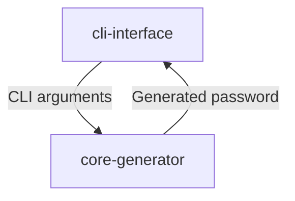

## System Context

CLI Password Generator is a command-line tool that generates secure, customizable passwords based on user-defined length and character set constraints.

## Services

| Service | Stack | Port | Role |
|---|---|---|---|
| cli-interface | Python, Argparse | * | Handles terminal arguments and user output |
| core-generator | Python | * | Contains the pure logic for randomizing and validating passwords |

> This table is the single source of truth for valid `service` values used in ADR frontmatter.

### cli-interface

- **Port:** *
- **Role:** Handles terminal arguments and user output
- **Stack:** Python, Argparse
- **Communicates with:** core-generator

### core-generator

- **Port:** *
- **Role:** Contains the pure logic for randomizing and validating passwords
- **Stack:** Python
- **Communicates with:** cli-interface

## Infrastructure

- [Database:] *[to be filled]*
- [Cache:] *[to be filled]*
- [Blob Storage:] *[to be filled]*
- [CI/CD Pipeline:] *[to be filled]*

## Communication Patterns

| Pattern | When |
|---|---|
| Sync | CLI argument parsing and password generation |
| Async | *[to be filled]*
| Real-time | *[to be filled]*

## Solution Diagram

